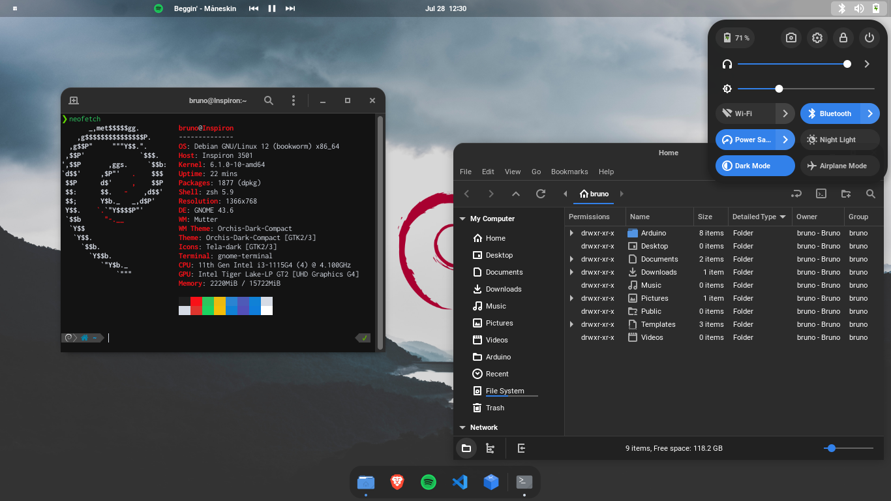

# myTheme
Esta es la compilación de personalizaciones que uso en mi sistema Debian junto con el entorno de escritorio GNOME y algunas extensiones.


## Descripción
Este script lo programe para hacerme mas fácil la instalación de todo mi entorno e interfaz gráfica de Debian, si a alguno le sirve aquí la comparto.

## Themes utilizados
- [Orchis theme](https://github.com/vinceliuice/Orchis-theme) 
- [Tela icons](https://github.com/vinceliuice/Tela-icon-theme) 
- [Volantes cursors](https://github.com/varlesh/volantes-cursors) 
- [Wallpaper](https://wallhaven.cc/w/x8893d) 
- [Roboto font](https://fonts.google.com/specimen/Roboto) 
- [Roboto mono font](https://fonts.google.com/specimen/Roboto+Mono) 
- [Inconsolata NF](https://fonts.google.com/specimen/Inconsolata)
- [Oh My ZSH!](https://github.com/ohmyzsh/ohmyzsh)
- [Powerlevel10k](https://github.com/romkatv/powerlevel10k)
- [deb10 Plymouth](https://gitlab.com/maurom/deb10) 

 ## Extensiones utilizadas
- [ArcMenu](https://extensions.gnome.org/extension/3628/arcmenu/)
- [Bluetooth Quick Connect](https://extensions.gnome.org/extension/1401/bluetooth-quick-connect/) 
- [Blur my Shell](https://extensions.gnome.org/extension/3193/blur-my-shell/) 
- [Dash to Dock](https://extensions.gnome.org/extension/307/dash-to-dock/) 
- [Dash to Panel](https://extensions.gnome.org/extension/1160/dash-to-panel/) 
- [Media Controls](https://extensions.gnome.org/extension/4470/media-controls/) 
- [Tray Icons: Reloaded](https://extensions.gnome.org/extension/2890/tray-icons-reloaded/) 
- [User Themes](https://extensions.gnome.org/extension/19/user-themes/) 

## Dependencias
El script ya se encarga de instalar las dependencias, lo que si esta todo basado en un sistema Debian 12 (bookworm) con GNOME 43 en Xorg en otras distribuciones basadas en Debian muy seguramente funcione igual. <br>
Las dependencias a instalar son: `git curl wget make zsh nemo inkscape dconf-cli uuid-runtime libsass1 sassc gnome-themes-extra gtk2-engines-murrine feh` <br>
Al terminar la instalacion si se desea, se desinstalaran las dependencias `feh inkscape`
## Instalación
Cambiar a GNOME con Xorg.

```
git clone https://github.com/brunojardon/myTheme.git
cd myTheme
./install.sh
```

En el procedimiento se descargan varios recursos, estos son eliminados cuando ya se completo su función.
